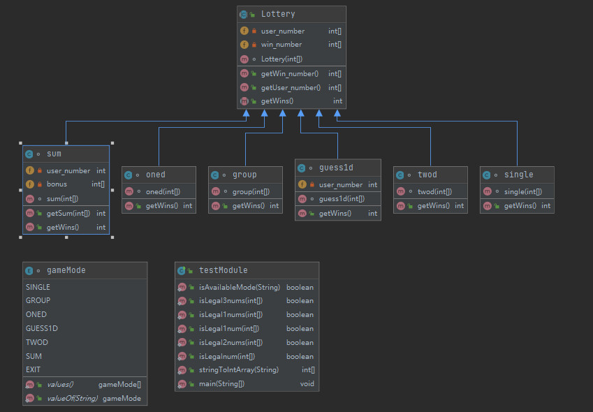
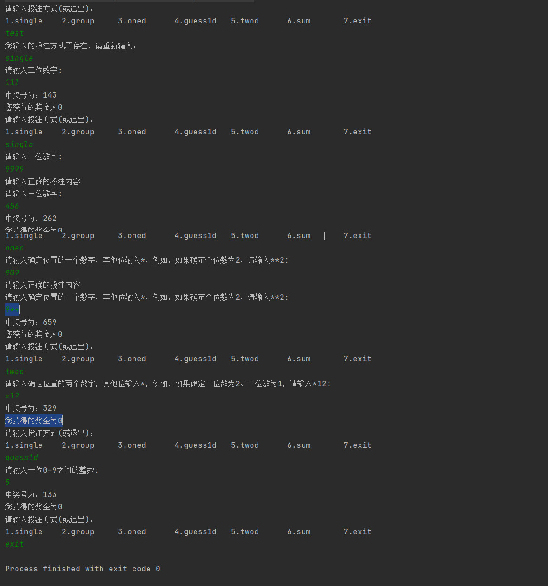

# Lottery3D实验报告

no comment

## 主要功能
1.	实现**单选**、**组选**、**1D**、**猜1D**、**2D**、**和数**六种玩法，玩家选择一种游戏模式或者**退出游戏**。
2.	不同玩法有不同的输入规则，验证输入是否合法。
3.	每次游戏中奖号随机生成，且<u>中奖号在输入投注号码后生成，增加游戏的可玩性</u>。

## 设计思路
-	游戏模式输入的合法性通过创建一个`enum`的类来判断输入是否属于此类中的成员；
-	投注号码的合法性通过创建五个检查数组内容的函数来判断（`single`、`group`均为三位数字，`oned`为一位数字两位'\*'，`guess1d`为一位数字，`twod`为两位数字一位'\*'，`sum`为0~27之间的数字），先将用户输入的字符串转为数组（* 转为 -1， 非*字符转为-2），再判断。

- 将超类`Lottery`设置为抽象类，之后创建一个抽象类的对象变量来引用子类对象。
    > 数据成员：
    >>用户投注号码，构造函数初始化
      中奖号码，构造函数内随机生成

    > 成员函数：
    >>获取用户号码和中奖号码的两个函数；
      抽象函数getWins()，由子类重写，返回获奖金额。

## 关键代码流程图

 
## 测试案例设计
- 玩法输入测试

| 玩法输入  | 是否合法(yes/no)|
| :--:     | :-----:         |
| test | N |
|GUess1D|Y|
|sum|Y|
| 123 |N|
|singl|N|
|singlegroup|N|

- 奖金输入测试

<table>
	<tr>
	    <th>玩法</th>
	    <th>输入（奖金）</th>
	    <th>是否合法(yes/no)</th>  
	</tr >
	<tr >
	    <td rowspan="6">single/group</td>
	    <td>9999</td><td>N</td>
	</tr><tr>
	    <td>123</td><td>Y</td>
	</tr><tr>
	    <td>1</td><td>N</td>
	</tr><tr>
	    <td>**1</td><td>N</td>
	</tr><tr>
        <td>1A</td><td>N</td>
	</tr><tr>
	    <td>group</td><td>N</td>
	</tr>
	<tr>
	    <td rowspan="4">guess1d</td>
	    <td>10</td><td>N</td>
	</tr>
	<tr>
	    <td>a</td><td>N</td>
	</tr>
	<tr>
	    <td >*</td><td>N</td>
	</tr>
    <tr>
	    <td >5</td><td>Y</td>
	</tr>
	<tr>
	    <td rowspan="4">oned/twod</td>
	    <td>***</td><td>N</td>
	</tr>
	<tr>
	    <td >123</td><td >N</td>
	</tr>
	<tr>
	    <td >*8*</td><td >Y</td>
	</tr>
	<tr>
	    <td >**8</td><td >Y</td>
	</tr>
	<tr>
	    <td rowspan="5">sum</td>
	    <td >as</td><td >N</td>
	</tr>
    <tr>
	    <td >**</td><td >N</td>
	</tr>
    	<tr>
	    <td >27</td><td >Y</td>
	</tr>
    	<tr>
	    <td >*1</td><td >N</td>
	</tr>
</table>

## 游戏截图

## 心得与收获

1. 在大佬们的帮助下学习使用Markdown基本语法编辑实验报告，并将源代码上传至GitHub；
2. 熟悉Java类继承的基本原理及部分操作；
3. 判断字符是否正确时写了五个不同的函数，十分臃肿，希望后续能学会使用其他方法。
4. 前期思维一直处于模糊混沌状态（现在也是如此），深深认识到自己的水平之低，同时更坚定了投身于代码事业的决心。

## 源代码
已上传至GitHub个人仓库
链接：[点我传送](https://github.com/Fissionalist/Lottery3D)
